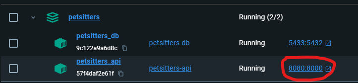

# APIwithDB    
    
## Описание    
    
Этот проект представляет собой API на основе FastAPI с использованием базы данных PostgreSQL, развернутых в Docker.  
    
## Требования    
    
- Docker  
- Docker Compose  
- DBeaver (опционально, для того что бы посмотреть БД)  
  ## Установка    
    
### 1. Клонируйте репозиторий:  
```sh  
cd <ваша директория>
git clone https://github.com/Filippokus/APIwithDB
```  
### 2. Создайте файл `.env` в корне проекта и укажите следующие переменные:  
```makefile  
POSTGRES_DB=petsitters  
POSTGRES_USER=postgres  
POSTGRES_PASSWORD=postgrespass  
POSTGRES_HOST=db  # или 'localhost', если вы запускаете его локально, но в Docker лучше 'db'  
    
DB_HOST_PORT=5433  
API_HOST_PORT=8080  
  
POSTGRES_DEBUG=True  
DEBUG=True  
```  
Про порты можно узнать [здесь](#Создание.env)
## Запуск  
  
1. Остановите и удалите все существующие контейнеры, если они есть:  
  
`docker-compose down -v`  
  
2. Запустите контейнеры:  
  
`docker-compose up --build`  
  
Это создаст и запустит два контейнера:  
  
- `petsitters_db`: контейнер с PostgreSQL и базой данных, инициализированный из `backup.sql`.  
- `petsitters_api`: контейнер с FastAPI приложением.  
  
API будет доступен по адресу: `http://localhost:8000`, что бы посмотреть и воспользоваться запросами добавьте  `/docs` к адресу.
Также адрес можно посмотреть в Docker:


В данном случае, на скриншоте порт указан 8080, т.е. в файле .env указывали API_HOST_PORT=8080. 
Аналогично с базой данных указан порт, по которому можно подключиться к базе данных.
  
  
## Подключение к базе данных  
  
Вы можете подключиться к базе данных с помощью DBeaver или другого клиента, используя следующие настройки:  
  
- Хост: `localhost`  
- Порт: `5433`  
- Пользователь: `postgres`  
- Пароль: `postgrespass`  
- База данных: `petsitters`

## Updatelog

### 1.0
Введем лог обновлений, что бы можно было просматривать текущее состояние проекта.

#### Создание .env
Концепция портов в Docker заключается в том, что у каждого контейнера есть свои внутренние порты, которые могут быть отображены на порты хоста. В нашем случае у нас есть два контейнера: один для базы данных PostgreSQL и один для приложения API. 

Теперь при создании файла .env нужно указывать порты:
- DB_HOST_PORT (5433) - Этот порт указывает, на каком порту ваш хост (ваш компьютер или сервер) будет доступен контейнер с базой данных PostgreSQL. То есть, когда вы хотите подключиться к базе данных снаружи контейнера, вы будете использовать этот порт.
- DB_CONTAINER_PORT (5432) - Этот порт указывает, на каком порту контейнер с PostgreSQL слушает запросы внутри контейнера. Обычно для PostgreSQL используется порт 5432 по умолчанию. ⛔️ Сейчас порт указывается по умолчанию в программе, их указывать не надо.
- API_HOST_PORT (8000) - Этот порт указывает, на каком порту ваш хост (ваш компьютер или сервер) будет доступен контейнер с вашим API. То есть, когда вы хотите получить доступ к вашему API снаружи контейнера, вы будете использовать этот порт. 
- API_CONTAINER_PORT (8000) - Этот порт указывает, на каком порту контейнер с API слушает запросы внутри контейнера. В нашем случае, приложение API настроено слушать на порту 8000.  ⛔️ Сейчас порт указывается по умолчанию в программе, их указывать не надо.
##### Как это работает?

1. **DB_HOST_PORT (5433)**
    
    **(5432)**
    
    - Внешний мир (хост) видит базу данных на порту 5433.
    - Внутри контейнера база данных слушает на порту 5432.
    - Когда вы подключаетесь к базе данных с вашего хоста, вы используете порт 5433, но внутри контейнера этот запрос перенаправляется на порт 5432.
2. **API_HOST_PORT (8000)**
    
    **(8000)**
    
    - Внешний мир (хост) видит API на порту 8000.
    - Внутри контейнера API слушает на порту 8000.
    - Когда вы подключаетесь к API с вашего хоста, вы используете порт 8000, и внутри контейнера этот запрос остается на порту 8000.

### 1.0.1
#### Добавлена маршрут удаления вопроса по id
При удалении вопроса удалятся и всего его ответы.